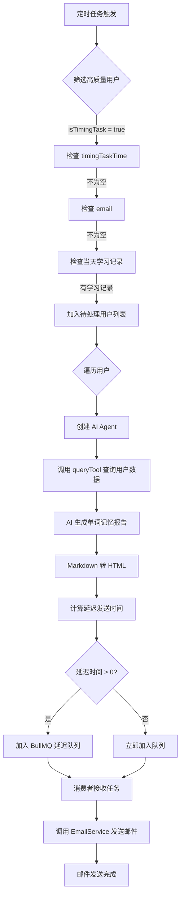

# 定时邮件发送业务

## 业务流程图



## 详细业务流程

### 第一阶段：定时任务触发

系统启动时，`DigestService` 在 `onModuleInit` 钩子中注册定时任务。该任务使用 cron 表达式 `0 0 * * *`（每天 0 点执行），触发
`EVERY_DAY_DIGEST_TASK` 任务。

### 第二阶段：用户筛选

`handleMailDigest()` 方法从数据库中筛选符合以下所有条件的用户：

| 条件 | 字段 | 说明 |
|------|------|------|
| 开启定时任务 | `isTimingTask = true` | 用户主动开启邮件推送功能 |
| 有定时任务时间 | `timingTaskTime` 不为空字符串 | 用户设置了具体的发送时间 |
| 有邮箱地址 | `email` 不为 null | 能够接收邮件 |
| 当天有学习记录 | `wordBookRecords.some(...)` | 今天学过单词，保证报告有内容 |

### 第三阶段：AI 生成报告

为每个符合条件的用户执行以下步骤：

#### 3.1 创建 AI Agent

```typescript
const agent = createAgent({
	model: createModel(),
	tools: [this.queryTool()],
	systemPrompt: '你是一个单词记忆助手，根据用户信息和单词记录，生成单词记忆报告',
});
```

#### 3.2 调用 queryTool 查询数据

`queryTool` 是一个 LangChain 工具，根据用户 ID 查询：

- **用户基本信息**：邮箱、姓名、单词总数
- **当天学习记录**：通过 `wordBookRecords` 关联查询，过滤条件为 `createdAt` 在今天 00:00:00 到明天 00:00:00 之间

查询结果包含用户学习的具体单词列表。

#### 3.3 生成报告

Agent 接收用户查询请求，调用 `queryTool` 获取数据后，生成 Markdown 格式的单词记忆报告。报告内容包括用户当天学习的单词统计和记忆建议。

#### 3.4 格式转换

使用 `marked` 库将 Markdown 报告转换为 HTML 格式，以便邮件客户端正确渲染。

### 第四阶段：延迟发送计算

根据用户设置的 `timingTaskTime`（格式为 `HH:mm`）计算延迟时间：

```
1. 解析用户设置的时间：hour = 20, minute = 30（示例）
2. 创建目标时间：今天 20:30:00
3. 计算延迟：目标时间 - 当前时间
4. 如果延迟 < 0（已过时间），则延迟 = 0（立即发送）
```

**计算逻辑**：

- 使用 `dayjs` 处理时间
- `startOf('day')` 获取今天 00:00:00
- `set('hour', hour).set('minute', minute)` 设置目标时间
- `target.diff(dayjs())` 计算时间差（毫秒）

### 第五阶段：加入消息队列

将邮件任务以延迟方式加入 BullMQ 队列：

```typescript
this.queue.add(
	digestConfig.task.emailDigest,  // 任务类型
	{
		userId: user.id,      // 用户 ID
		text: html,           // HTML 格式的报告
		email: user.email,    // 收件人邮箱
	},
	{
		delay: delay,  // 延迟时间（毫秒）
	},
);
```

**队列机制**：

- 任务被添加到 Redis 的延迟集合中
- 在延迟时间到达前，任务不会被消费者处理
- 延迟时间到达后，任务自动移动到待处理队列

### 第六阶段：消费者处理

`TestProcessor` 作为消费者监听队列，处理 `EMAIL_DIGEST_TASK` 类型的任务：

```typescript
if (job.name === digestConfig.task.emailDigest) {
	const {text, email} = job.data;
	this.emailService.sendEmail(email, '每日单词记忆报告', text);
}
```

调用 `EmailService.sendEmail` 发送邮件，参数包括：

- 收件人邮箱
- 邮件主题：「每日单词记忆报告」
- 邮件内容：HTML 格式的报告

### 第七阶段：完成

邮件发送完成后，任务从队列中移除，整个流程结束。

## 数据流转

```
用户设置定时任务 → 数据库记录用户偏好
       ↓
定时任务触发 → 查询符合条件的用户
       ↓
AI Agent → 调用 queryTool 查询用户数据
       ↓
生成 Markdown 报告 → 转换为 HTML
       ↓
计算延迟时间 → 加入 BullMQ 延迟队列
       ↓
延迟时间到达 → 消费者接收任务
       ↓
EmailService 发送邮件 → 用户收到报告
```

## 关键类与方法

| 类名              | 方法                 | 职责                     |
|-----------------|--------------------|------------------------|
| `DigestService` | `handleMailDigest` | 筛选用户、生成报告、计算延迟、加入队列    |
| `DigestService` | `queryTool`        | 创建查询用户数据的 LangChain 工具 |
| `TestProcessor` | `process`          | 消费队列任务、发送邮件            |
| `EmailService`  | `sendEmail`        | 实际发送邮件                 |

## 已知问题与限制

### 1. 延迟时间计算逻辑

当前逻辑：如果用户设置的时间已过（如现在 21:00，用户设置 20:30），delay = 0，立即发送。

```
目标时间 <= 当前时间 → delay = 0（立即发送）
目标时间 > 当前时间  → delay = 目标时间 - 当前时间
```

**设计考量**：保持当前实现，用户修改定时时间后新设置在第二天生效。

### 2. AI Agent 调用无错误处理

`agent.invoke()` 可能因 LLM API 调用失败而抛出异常，当前无 try-catch，会导致整个流程中断。

### 3. 邮件发送失败无重试

`emailService.sendEmail()` 失败后无重试机制，任务直接丢失。需要人工介入或后续补发机制。

### 4. 用户修改定时时间的影响

用户修改定时时间后，已入队的任务不会自动消失或更新。当前设计：新设置在第二天 `handleMailDigest` 执行时生效。
