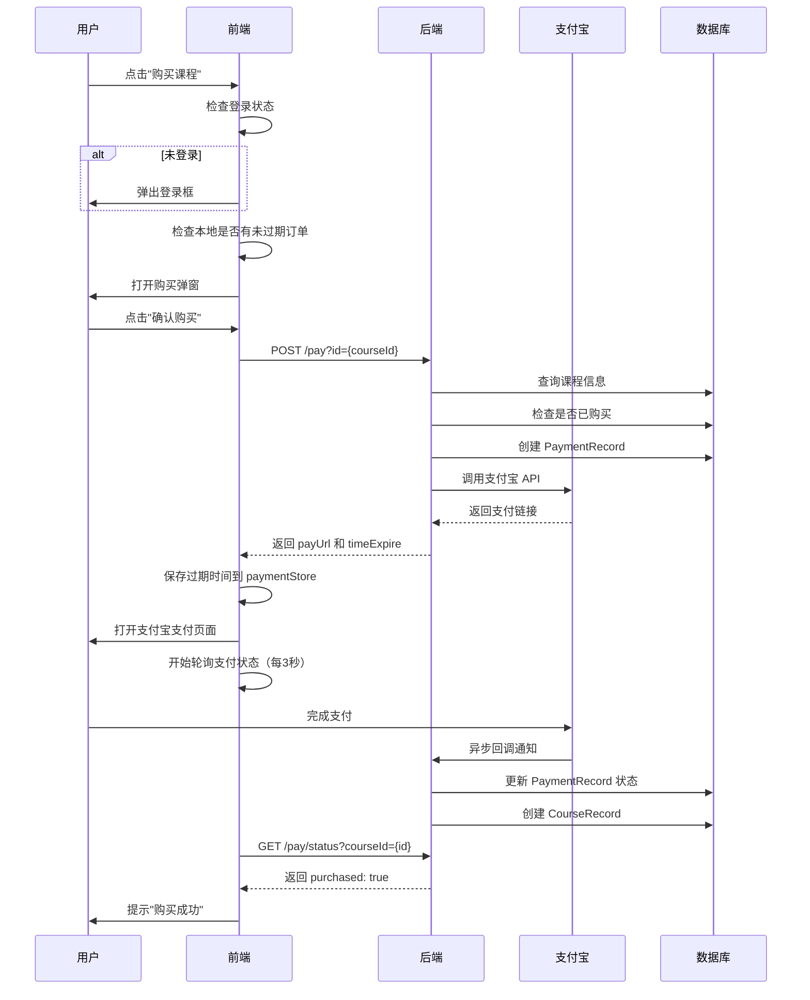

# 支付功能业务流程文档

## 概述

本文档描述了英语学习应用的支付功能业务流程，包括前后端交互、支付宝集成、订单状态管理等核心逻辑。

支付流程采用**支付宝网页支付**方式，用户在前端选择课程后，系统创建订单并跳转到支付宝支付页面，同时通过轮询机制实时检测支付状态。

## 业务流程图



## 前端流程

### 1. 课程页面 (courses.vue)

**文件**: `apps/web/src/views/courses.vue`

页面加载时执行：
```typescript
onMounted(() => {
  getList();         // 获取全部课程列表
  getPurchasedList(); // 获取已购课程列表
});
```

**购买按钮点击处理**:
```typescript
const handlePurchase = (course: Course) => {
  selectedCourse.value = course;
  if (!useTokenStore().accessToken || !userStore.user) {
    // 未登录，弹出登录框
    loginModalStore.setLoginDialogVisible(true);
  } else {
    // 已登录，检查是否有未过期的订单
    checkExistingPayment(course.id);
    purchaseModalOpen.value = true;
  }
};
```

### 2. 支付 Hook (usePayment)

**文件**: `apps/web/src/composables/business/pay/usePayment.ts`

核心功能：
- `startPayment(courseId)`: 发起支付
- `checkExistingPayment(courseId)`: 检查已有支付
- `countdown`: 倒计时显示文本
- `isPay`: 是否正在支付

**发起支付流程**:
```typescript
const startPayment = async (courseId: string): Promise<boolean> => {
  const res = await createOrder(courseId);
  
  // 保存支付过期时间（持久化）
  paymentStore.setPayExpire(courseId, res.data.timeExpire);
  // 开始倒计时
  startCountdown(res.data.timeExpire);
  // 打开支付宝支付页面
  window.open(res.data.payUrl, "_blank");
  // 开始轮询支付状态
  startPolling(courseId);
  
  return true;
};
```

**轮询机制**:
- 轮询间隔：3000ms（3秒）
- 调用 `checkPaymentStatus(courseId)` 检查支付状态
- 支付成功后停止轮询并提示用户

### 3. 支付 API

**文件**: `apps/web/src/api/server/pay.ts`

```typescript
// 创建支付订单
export const createOrder = (courseId: string): Result<ResultPay> => {
  return serverInstance.post(`/pay?id=${courseId}`);
};

// 检查支付状态
export const checkPaymentStatus = (courseId: string): Result<{ purchased: boolean }> => {
  return serverInstance.get(`/pay/status?courseId=${courseId}`);
};
```

### 4. 支付状态存储 (paymentStore)

**文件**: `apps/web/src/stores/payment.ts`

使用 Pinia + persistedstate 持久化存储支付过期时间：

```typescript
const payExpireMap = ref<Record<string, number>>({});

const setPayExpire = (courseId: string, timeExpire: number) => {
  payExpireMap.value[courseId] = timeExpire;
};

const getPayExpire = (courseId: string): number | null => {
  return payExpireMap.value[courseId] || null;
};

const clearAllExpired = () => {
  const now = Date.now();
  Object.keys(payExpireMap.value).forEach((courseId) => {
    const expireTime = payExpireMap.value[courseId];
    if (expireTime !== undefined && expireTime <= now) {
      delete payExpireMap.value[courseId];
    }
  });
};
```

## 后端流程

### 1. 支付控制器 (PayController)

**文件**: `server/apps/server/src/pay/pay.controller.ts`

| 接口 | 方法 | 说明 |
|------|------|------|
| `/pay` | POST | 创建支付订单 |
| `/pay/status` | GET | 检查支付状态 |
| `/pay/notify` | ALL | 支付宝回调通知 |

### 2. 支付服务 (PayService)

**文件**: `server/apps/server/src/pay/pay.service.ts`

#### 创建订单流程

```typescript
async create(courseId: string, userId: string) {
  // 1. 查询课程信息
  const course = await this.prisma.course.findUnique({ where: { id: courseId } });
  
  // 2. 检查是否已购买
  const [courseRecord, paymentRecord] = await Promise.all([
    this.prisma.courseRecord.findFirst({ where: { userId, courseId } }),
    this.prisma.paymentRecord.findFirst({
      where: { userId, course_id: courseId },
      orderBy: { createdAt: 'desc' }
    }),
  ]);
  
  // 3. 生成交易号
  const outTradeNo = `PAY-${nanoid(12)}`;
  
  // 4. 创建支付记录
  const order = await this.prisma.paymentRecord.create({
    data: { userId, outTradeNo, amount: course.price, ... }
  });
  
  // 5. 设置过期时间（15分钟）
  const datetime = dayjs().add(15, 'minute');
  
  // 6. 调用支付宝 API
  const result = this.alipayService.alipaySdk.pageExecute(
    'alipay.trade.page.pay', 'GET', { bizContent, notify_url: ... }
  );
  
  return { payUrl: result, timeExpire: datetime.toDate().getTime() };
}
```

#### 处理支付宝回调

```typescript
async handleAlipayNotify(userId, courseId, outTradeNo, tradeStatus, tradeNo, gmt_payment) {
  if (tradeStatus === TradeStatus.TRADE_SUCCESS) {
    await this.prisma.$transaction(async (tx) => {
      // 1. 更新支付记录状态
      await this.prisma.paymentRecord.update({
        where: { outTradeNo },
        data: { tradeStatus, sendPayTime: dayjs(gmt_payment).toDate(), tradeNo }
      });
      
      // 2. 创建课程购买记录
      await this.prisma.courseRecord.create({
        data: { userId, courseId, isPurchased: true, paymentRecordId: updateResult.id }
      });
    });
  }
}
```

### 3. 支付宝服务 (AlipayService)

**文件**: `server/libs/shared/src/pay/pay.service.ts`

初始化支付宝 SDK，配置信息从环境变量读取：
- `ALIPAY_APP_ID`: 应用ID
- `ALIPAY_PRIVATE_KEY`: 应用私钥
- `ALIPAY_PUBLIC_KEY`: 支付宝公钥
- `ALIPAY_GATEWAY`: 网关地址

## 数据库模型

### PaymentRecord（支付记录表）

```prisma
model PaymentRecord {
  id           String         @id @default(cuid())
  userId       String
  tradeNo      String?        // 支付宝交易号
  outTradeNo   String         @unique  // 商户订单号
  amount       Decimal        // 订单金额
  subject      String         // 订单标题
  body         String         // 订单描述
  tradeStatus  TradeStatus    @default(NOT_PAY)  // 交易状态
  sendPayTime  DateTime?      // 付款时间
  createdAt    DateTime       @default(now())
  updatedAt    DateTime       @updatedAt
  course_id    String         // 关联课程ID
}
```

### CourseRecord（课程购买记录表）

```prisma
model CourseRecord {
  id              String         @id @default(cuid())
  userId          String
  courseId        String
  isPurchased     Boolean        @default(false)
  createdAt       DateTime       @default(now())
  updatedAt       DateTime       @updatedAt
  paymentRecordId String?
  
  @@unique([userId, courseId])  // 用户+课程唯一约束
}
```

### TradeStatus（交易状态枚举）

```prisma
enum TradeStatus {
  NOT_PAY          // 未支付
  WAIT_BUYER_PAY   // 等待买家付款
  TRADE_CLOSED     // 交易关闭
  TRADE_SUCCESS    // 交易成功
  TRADE_FINISHED   // 交易结束
}
```

## 定时任务

### 过期订单处理

**文件**: `server/apps/server/src/pay/payment-expiration.service.ts`

每15分钟执行一次，将超过15分钟未支付的订单状态更新为 `TRADE_CLOSED`：

```typescript
@Cron('*/15 * * * *')
async handleExpiredPayments() {
  const fifteenMinutesAgo = dayjs().subtract(15, 'minute').toDate();
  
  const expiredOrders = await this.prisma.paymentRecord.updateMany({
    where: {
      tradeStatus: { in: [TradeStatus.NOT_PAY, TradeStatus.WAIT_BUYER_PAY] },
      createdAt: { lt: fifteenMinutesAgo }
    },
    data: { tradeStatus: TradeStatus.TRADE_CLOSED }
  });
}
```

## 关键文件清单

### 前端文件

| 文件路径 | 说明 |
|----------|------|
| `apps/web/src/views/courses.vue` | 课程页面 |
| `apps/web/src/composables/business/pay/usePayment.ts` | 支付 Hook |
| `apps/web/src/api/server/pay.ts` | 支付 API |
| `apps/web/src/stores/payment.ts` | 支付状态存储 |

### 后端文件

| 文件路径 | 说明 |
|----------|------|
| `server/apps/server/src/pay/pay.controller.ts` | 支付控制器 |
| `server/apps/server/src/pay/pay.service.ts` | 支付服务 |
| `server/apps/server/src/pay/payment-expiration.service.ts` | 过期订单处理 |
| `server/apps/server/src/pay/pay.module.ts` | 支付模块 |
| `server/libs/shared/src/pay/pay.service.ts` | 支付宝服务 |
| `server/prisma/schema.prisma` | 数据库模型定义 |

### 共享包

| 文件路径 | 说明 |
|----------|------|
| `packages/common/pay/index.ts` | 支付相关类型定义 |

## 注意事项

1. **订单过期时间**: 前端和后端都设置了15分钟过期时间，前端用于倒计时显示，后端用于定时任务清理
2. **幂等性检查**: 创建订单时会检查用户是否已购买该课程，防止重复购买
3. **轮询机制**: 前端每3秒轮询一次支付状态，支付成功后停止轮询
4. **持久化存储**: 前端使用 Pinia + persistedstate 持久化支付过期时间，刷新页面后可恢复倒计时
5. **分布式部署**: 如果多实例部署，需要考虑分布式锁避免重复处理过期订单
